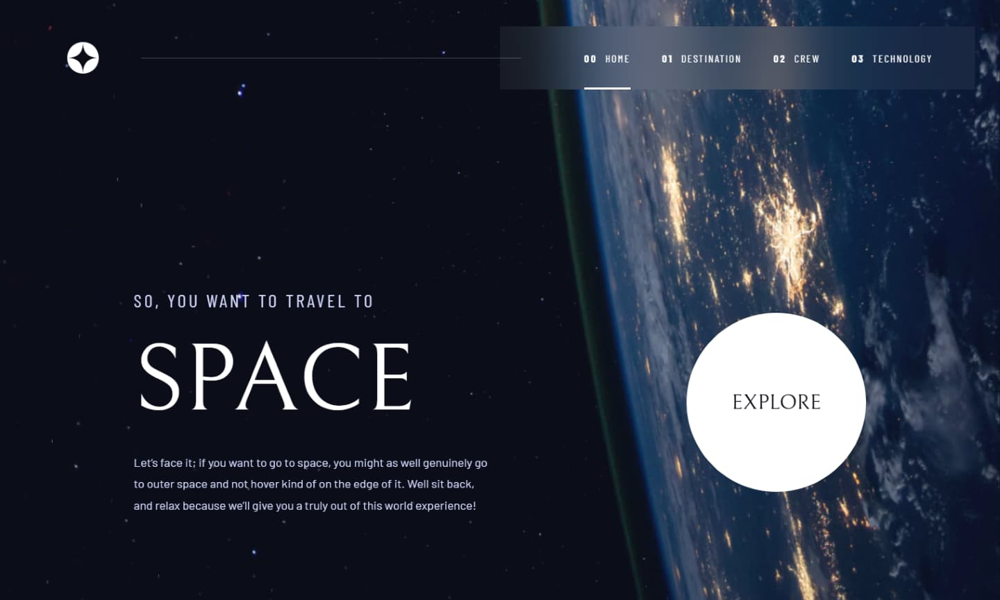
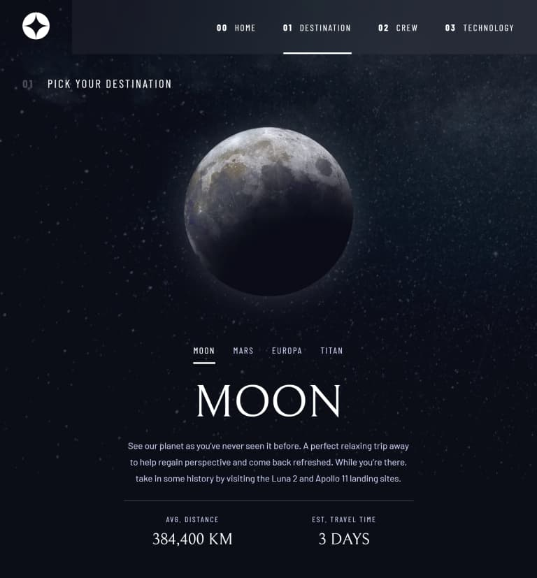
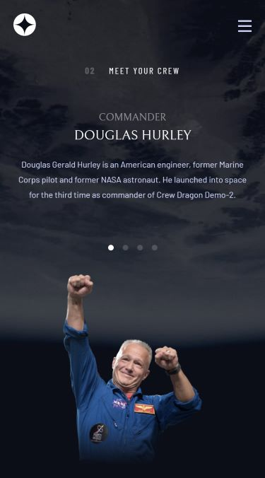

# Space Tourism Multi-Page Website

A high-performance, fully accessible multi-page space tourism application built with **React**, **Vite**, **Framer Motion**, and **SCSS**. This project is a solution to the Frontend Mentor challenge, designed with a focus on seamless user experience, modular styling, and top-tier web standards.

## Features

- **Dynamic Content Exploration:** Navigate through "Destination", "Crew", and "Technology" pages with data dynamically rendered from a centralized JSON.
- **Interactive UI:** Smooth page transitions and element animations powered by **Framer Motion**.
- **Advanced Accessibility (A11y):** \* 90-100/100 Lighthouse Accessibility score.
  - Proper heading hierarchy and semantic HTML5 tags.
  - ARIA roles and labels for interactive elements (Tabs, Mobile Menu).
  - Enhanced keyboard navigation support.
- **Modular SCSS Architecture:** Clean and maintainable styling using SCSS variables, mixins, and a structured component-based approach.
- **Optimized Performance:** \* Efficient asset delivery with `.webp` image support.
  - Preloaded critical fonts for faster initial paint.
  - Explicit image dimensions to minimize Layout Shift (CLS).

## Deployment

This project is built using **Vite** and deployed on **Vercel**.
[View on Vercel](https://space-tourism-ten-kappa.vercel.app/)


## Screenshots

|                       Desktop                       |                      Tablet                       |                      Mobile                       |
| :-------------------------------------------------: | :-----------------------------------------------: | :-----------------------------------------------: |
|  |  |  |

## Tech Stack

- **React:** Component-based UI development.
- **Vite:** Next-generation frontend tooling.
- **JavaScript (ES6+)**: Programming language.
- **Framer Motion:** Declarative animations for React.
- **SCSS:** Advanced styling with variables and modular imports.
- **React Router:** For seamless client-side navigation.

## Getting Started

### 1. Clone the Repository

```bash
git clone [https://github.com/LenaM777/space-tourism.git](https://github.com/LenaM777/space-tourism.git)
cd space-tourism
```

### 2. Install Dependencies

Navigate to the project directory and install the required npm packages:

```bash
npm install
# or
# yarn install
```

### 3. Run the Development Server

Once the dependencies are installed and the environment variable is set, you can start the development server:

```bash
npm run dev
# or
# yarn dev
```

This will usually start the app on `http://localhost:5173`. Open this URL in your web browser to see the application.

## Project Structure

```plaintext
space-tourism/
├── public/
│   ├── assets/        # Page-specific images (Crew, Destination, etc.)
│   ├── fonts/         # Barlow, Barlow Condensed, and Bellefair fonts
│   └── robots.txt
├── src/
│   ├── assets/        # Global icons (logo, hamburger, close)
│   ├── components/    # Reusable UI components (Header, etc.)
│   ├── layout/        # Layout wrappers
│   ├── pages/         # Page-level components with dedicated SCSS
│   ├── router/        # App routing logic
│   ├── styles/        # Global styles, variables, mixins, and typography
│   ├── utils/         # Helper functions and animation variants
│   ├── data.json      # Centralized project content
│   ├── App.jsx        # Main application component
│   └── main.jsx       # Entry point
└── vite.config.js
```

## How It Works

- State Management: Uses React's useState and useEffect to manage navigation states and update content dynamically based on the active tab.
- Modular Styling: Styles are organized into global configurations (\_variables.scss, \_mixins.scss) and component-specific files, ensuring scalability.
- Animations: Custom animation variants are defined in utils/animations.js and applied using Framer Motion's motion components and AnimatePresence.
- Image Handling: The application handles different image orientations (Landscape/Portrait) for the Technology section to ensure optimal display on all devices.
